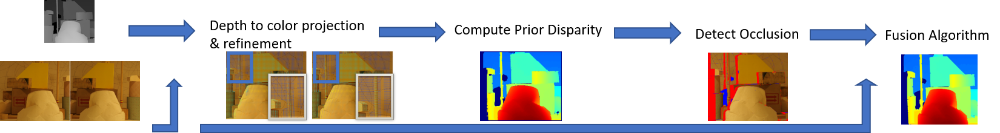

This is a Implementation of paper 'High-Resolution Depth Maps Based on TOF-Stereo Fusion' with novel sparse depth interpolation method.

## Pipeline




## STRUCTURE
``` text
.
├── Dependencies
├── fusion
|   │
|   ├── data 
|   │   ├── mb_lamp
|   │   ├── Monopoly
|   │   └── Plastic
|   ├── include
|   ├── src
|   └── res
└── fusion.sln
```

## Building

This project runs on windows x64 systems. The project is built using Visual Studio 2022 based on sln and vcxproj.

## Executing

I provide the binary file in the folder 'fusion'. You can run the program by double-clicking the fusion.exe file or using the cmmmand line without building the project.

The Result image will be saved in the folder fusion/data/*/output. The result images are colored disparity with post filling method, grayscale disparity without post filling method, and the prior disparity.

By editing parameters in res\config.txt, you can change the baseline, focal length and sample density(step parameter). You can also change the threshold for seed-growing method.

By editing strings in res\test_data_list.txt, you can choose the test data by adding the folder name of the test data into the file.